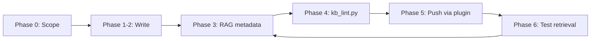

# KB workflow — Obsidian → agents → TPSReport

End-to-end lifecycle for building a **retrieval-tuned knowledge base** with the TPSReport stack.

---

## Overview



| Phase | Owner | Output |
|-------|-------|--------|
| **0 — Scope** | Human + agent | Section map, `kb_schema`, `metadata_canary` |
| **1–2 — Content** | Agent | `00_CONTEXT.md` + section pages with dense prose |
| **3 — Metadata** | Agent | Full RAG frontmatter on every content page |
| **4 — Lint** | Agent / CI | `kb_lint.py` exit 0 |
| **5 — Ship** | Human | Publish, push, RAG on, verify rendered report |
| **6 — Test** | Human + agent | Probe questions; iterate metadata |

Full agent instructions: **[tpsreport-skill/SKILL.md](tpsreport-skill/SKILL.md)**

---

## Phase 0 — Scope

Before writing pages:

1. Define **topic**, **audience**, and **voice**
2. Propose folder map: `01_Overview/`, `02_…`, `06_FAQ/`, etc.
3. Set `metadata_canary: your-topic-kb-2026` in `00_CONTEXT.md`
4. Declare **`kb_schema`** if the domain needs typed fields (movies, services, products)

See [examples/folder-structure.md](examples/folder-structure.md) and [examples/kb_schema-examples.md](examples/kb_schema-examples.md).

---

## Phase 1–2 — Seed and write

### Create the router first

`00_CONTEXT.md` is the master index:

- Purpose and scope
- `kb_schema` (if any)
- Document map with routing table
- Reading orders for different personas

### Content rules

- **Obsidian-native:** `[[wikilinks]]`, callouts (`> [!tip]`), `==highlights==`, tables, mermaid
- **Dense prose** — not stub bullet lists
- **Ground facts** in `source_materials` URLs; flag time-sensitive claims
- **Never edit** plugin-managed keys: `node_id`, `sync_status`, `last_synced`, `tps_content_hash`

---

## Phase 3 — RAG metadata

Every content page needs the **core set**:

| Key | Purpose |
|-----|---------|
| `summary` | 2–3 sentence abstract with concrete facts |
| `keywords` | 8–20 search terms, synonyms, acronyms |
| `tags` | Shared vocabulary across the KB |
| `intents` | snake_case jobs this page answers |
| `hyde_questions` | 4–8 natural questions the page fully answers |
| `retrieval_hint` | When to use **and** "Do NOT use for …" |
| `scenarios` | Concrete personas / situations |

Add routing keys when docs overlap: `canonical_for`, `defers_to`, `lifecycle_position`, `prerequisites`, `unlocks`, `see_also`.

Examples: [examples/frontmatter-page-example.md](examples/frontmatter-page-example.md)

---

## Phase 4 — Lint

```bash
python .cursor/skills/tpsreport-skill/kb_lint.py path/to/Your_KB/
```

| Flag | Effect |
|------|--------|
| `--strict` | Warnings fail the run |
| `--json` | Machine-readable output for agent fix loops |

The linter reads **`metadata-contract.yaml`** — same rules as the plugin **Gatekeeper**.

---

## Phase 5 — Ship (Obsidian)

Human steps (agent should **not** push without explicit approval):

1. Open vault in Obsidian → reload TPSReport plugin if needed
2. **Gatekeeper health check** on the KB folder
3. Right-click folder → **Publish as New Report** (first time) or **Push to TPS**
4. In TPSReport: enable **RAG indexing**, set visibility / destination
5. Verify rendered pages (links, callouts, images)

Plugin listing: [community.obsidian.md/plugins/tpsreport-sync](https://community.obsidian.md/plugins/tpsreport-sync)

---

## Phase 6 — Test retrieval

1. Collect 15–20 questions from collective `hyde_questions` across the KB
2. Run them against TPSReport Graph RAG / your agent
3. Note under-retrieving pages → tighten `summary`, `keywords`, `retrieval_hint`
4. Re-lint → re-push → re-test

---

## Quality checklist

- [ ] One `00_CONTEXT.md` router; no orphan topics
- [ ] 15–25 pages for a substantial KB (adjust to scope)
- [ ] No duplicate `canonical_for` topics
- [ ] `defers_to` values match real file slugs
- [ ] Single YAML frontmatter block per file
- [ ] `kb_lint.py` exit 0
- [ ] Gatekeeper clean in Obsidian

---

## Agent kickoff

Copy **[KB_AGENT_PROMPT.md](tpsreport-skill/KB_AGENT_PROMPT.md)**, fill in `[TOPIC]`, `[Folder_Name]`, and paste into Cursor / Claude Code.
